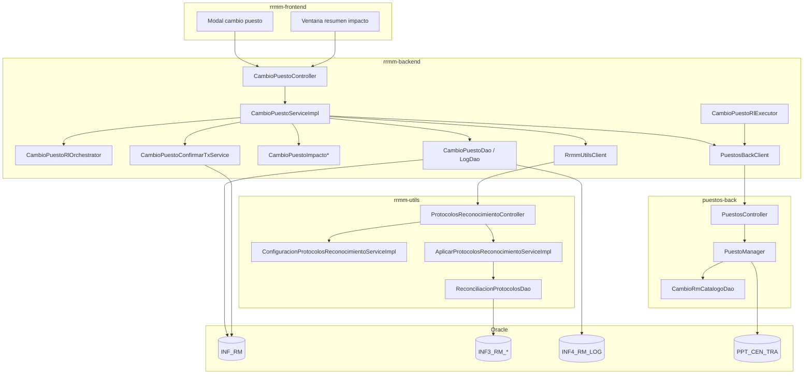
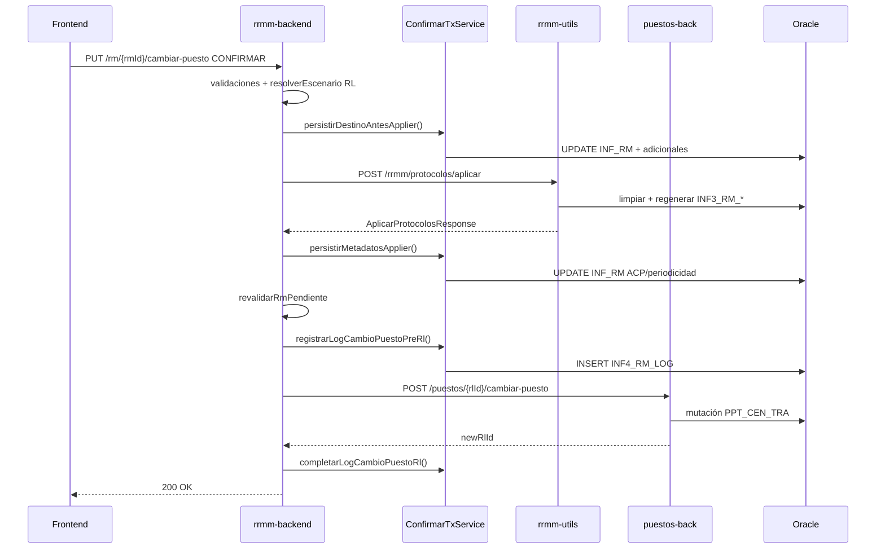

# Documentación técnica — Cambio de puesto en reconocimiento médico (MINERVA)

**Evolutivo:** Cambio de puesto desde ficha de RM pendiente con recálculo de protocolos  
**Referencia funcional:** RF v.6 (`funcional/RF_MINERVA_cambio_puesto_reconocimiento_y_protocolos_v6.md`)  
**Rama de desarrollo:** `feature/Cambio-puesto-sprint-1`  
**Última revisión:** Julio 2026

---

## 1. Objetivo técnico

Permitir que un usuario autorizado modifique **cliente, centro, puesto principal y puestos adicionales** de un reconocimiento médico en estado **pendiente**, con:

1. **SIMULAR** — dry-run del impacto (protocolos, pruebas, parámetros, perfiles, cuestionarios, periodicidad, fecha recomendada).
2. **CONFIRMAR** — persistencia coordinada en BD local, regeneración de `INF3_RM_*`, mutación de relación laboral y trazabilidad CA-17.

El desarrollo **no altera** el flujo legacy de cambio de puesto desde historial médico del trabajador.

---

## 2. Proyectos implicados

| Proyecto | Rol | Context path | Puerto local (dev) |
|----------|-----|--------------|-------------------|
| **rrmm-backend** | Orquestador principal. API pública del modal, validaciones, diff de impacto, persistencia `INF_RM`/`INF4_RM_LOG`, clientes HTTP | `/rrmm-backend` | 8825 |
| **rrmm-utils** | Motor de protocolos: dry-run (`/recalcular`) y materialización (`/aplicar`) sobre tablas `INF3_RM_*` | `/rrmm-utils` | 8081 |
| **puestos-back** | Catálogo de puestos del modal y mutación de relación laboral (`PPT_CEN_TRA`) | `/puestos-back` | 8080 |
| **rrmm-frontend** | Modal, ventana resumen, integración API (ver `Guia_FE_Cambio_Puesto_RM.md`) | — | — |

### Reparto de tareas MINERVA (backend)

| Tarea | Proyecto | Descripción |
|-------|----------|-------------|
| BE-02 | rrmm-backend | Búsqueda clientes modal |
| BE-03 | rrmm-backend | Listado centros con PVS |
| BE-04 | puestos-back + rrmm-backend (proxy) | Catálogo puestos + typeahead estándar |
| BE-05 | rrmm-backend + puestos-back | Puestos adicionales (lectura catálogo; escritura en CONFIRMAR) |
| BE-06 | rrmm-utils + rrmm-backend | SIMULAR / P1 dry-run |
| BE-07 | rrmm-utils + rrmm-backend | Applier `INF3_RM_*` |
| BE-08 | puestos-back | Mutación RL (`cambiar-puesto`) |
| BE-09 | rrmm-backend | Log CA-17 (`INF4_RM_LOG`) |
| BE-10 | rrmm-backend | Anti-concurrencia (revalidación RM pendiente) |

> **Nota histórica:** el contrato P1 se diseñó inicialmente en puestos-back (`entrega-cambio-puesto/Contrato_P1_dry_run_puestos-back.md`) pero **no se implementó allí**. El dry-run vive en rrmm-utils.

---

## 3. Arquitectura



### Principios de diseño

1. **Orquestación centralizada en rrmm-backend** — el frontend solo habla con rrmm-backend.
2. **Sin transacción global en CONFIRMAR** — commits locales acotados antes de llamadas HTTP remotas (evita interbloqueos con pool JDBC reducido en dev).
3. **RL al final** — la mutación en puestos-back es el último paso no reversible; si falla, se compensa el log CA-17.
4. **rrmm-utils no escribe `INF_RM`** — devuelve metadatos ACP/periodicidad; rrmm-backend los persiste en su transacción.
5. **JWT propagado** — el token del usuario se reenvía a puestos-back y rrmm-utils.

---

## 4. API pública (rrmm-backend)

**Controller:** `com.preving.restapi.rrmm.web.cambiopuesto.CambioPuestoController`  
**Base:** `/rrmm-backend/rm`

| Método | Path | Tarea | Descripción |
|--------|------|-------|-------------|
| `GET` | `/cambio-puesto/clientes?q=` | BE-02 | Búsqueda clientes (≥3 chars o CIF/NIF 8-12). Máx. `cambio-puesto.busqueda.clientes-max` |
| `GET` | `/cambio-puesto/centros?clienteId=&nombre=&provincia=&localidad=` | BE-03 | Centros con contrato PVS activo |
| `GET` | `/cambio-puesto/puestos/{clienteId}/{centroId}?rmId=` | BE-04/05 | Catálogo modal (prevención, vigilancia, estándar precargado) |
| `GET` | `/cambio-puesto/puestos/{clienteId}/{centroId}/estandar?rmId=&criterio=` | BE-04 | Typeahead puestos estándar (≥3 chars) |
| `PUT` | `/{rmId}/cambiar-puesto` | BE-06/07/08/09 | SIMULAR o CONFIRMAR según `request.accion` |

### Request unificado — `CambioPuestoRequest`

```json
{
  "clienteId": 234783,
  "centroId": 370960,
  "puestoId": 121937,
  "tipoPuesto": "CE",
  "estandar": 1,
  "puestosAdicionales": [
    { "puestoId": 999, "estandar": 0, "puestoNombre": "Auxiliar" }
  ],
  "accion": "SIMULAR"
}
```

| Campo | Valores | Notas |
|-------|---------|-------|
| `tipoPuesto` | `C`, `E`, `EC` | Centro, estándar, vigilancia |
| `estandar` | `0`, `1` | 1 = puesto estándar global |
| `accion` | `SIMULAR`, `CONFIRMAR` | Despacho en controller |

### Response SIMULAR — `CambioPuestoSimularResponse`

- `deltas` — diff por categoría (protocolos, pruebas, parámetros, perfiles, cuestionarios, periodicidad, fechaRecomendada)
- `avisos` — códigos funcionales (`protocolosImpacto`, `analiticaImpacto`, `laboratorioComunicado`, …)
- `rlEscenario` — `EDITAR`, `CREAR`, `ASOCIAR`, `SOLO_ADICIONALES`, `BLOQUEAR`
- `bloqueante`, `mensajeFuncional`

### Response CONFIRMAR — `CambioPuestoConfirmarResponse`

- `rmId`, `rlAfectadaId`, `rlAccion`, `logId` (CA-17), `warnings`

### Códigos HTTP de error

| Excepción | HTTP | Uso |
|-----------|------|-----|
| `CambioPuestoValidationException` | 422 | Validación de entrada o negocio |
| `CambioPuestoForbiddenException` | 403 | Sin permiso o RM no pendiente |
| `CambioPuestoConflictException` | 409 | Escenario BLOQUEAR, concurrencia |
| `CambioPuestoIntegrationException` | 502 | Fallo puestos-back o rrmm-utils |
| `CambioPuestoNotImplementedException` | 501 | SIMULAR deshabilitado / endpoint no disponible |

---

## 5. rrmm-backend — Componentes

### 5.1 Estructura de paquetes

```
com.preving.restapi.rrmm/
├── web/cambiopuesto/
│   └── CambioPuestoController.java
├── service/cambiopuesto/
│   ├── CambioPuestoService.java / CambioPuestoServiceImpl.java    ← orquestador
│   ├── CambioPuestoConfirmarTxService.java                        ← transacciones locales
│   ├── CambioPuestoRlOrchestrator.java                            ← escenarios RL
│   ├── CambioPuestoRlExecutor.java                                ← delegación puestos-back
│   ├── CambioPuestoImpactoReaderImpl.java                         ← snapshot actual (BD)
│   ├── RrmmUtilsImpactoPropuestoResolver.java                     ← snapshot propuesto (P1)
│   ├── CambioPuestoImpactoDeltaCalculator.java                    ← diff
│   ├── CambioPuestoImpactoSnapshotComposer.java
│   ├── CambioPuestoFechaRecomendadaCalculator.java
│   ├── CambioPuestoDestinoMatcher.java                            ← RF §6.2
│   ├── CambioPuestoAdicionalesMatcher.java
│   ├── CambioPuestoRrmmUtilsRequestMapper.java
│   ├── CambioPuestoRrmmUtilsImpactoMapper.java
│   ├── CambioPuestoSimularMockProvider.java
│   ├── CambioPuestoTrace.java
│   ├── PuestosBackClient.java / PuestosBackClientImpl.java
│   └── RrmmUtilsClient.java / RrmmUtilsClientImpl.java
├── dao/cambiopuesto/
│   ├── CambioPuestoDao.java / CambioPuestoDaoImpl.java
│   ├── CambioPuestoLogDao.java / CambioPuestoLogDaoImpl.java
│   ├── CambioPuestoRmUpdate.java
│   └── CambioPuestoConfigProtocolosUpdate.java
└── domain/cambiopuesto/
    ├── [DTOs API modal]
    └── integration/rrmmutils/   ← contratos HTTP hacia rrmm-utils
```

### 5.2 Servicios y responsabilidades

| Clase | Responsabilidad |
|-------|-----------------|
| `CambioPuestoServiceImpl` | Punto de entrada de negocio: modal, SIMULAR, CONFIRMAR |
| `CambioPuestoRlOrchestrator` | Determina escenario RL según origen/destino |
| `CambioPuestoRlExecutor` | Valida OK técnico local y llama `puestos-back` |
| `CambioPuestoConfirmarTxService` | `UPDATE INF_RM`, adicionales, log CA-17, metadatos applier |
| `CambioPuestoImpactoReaderImpl` | Lee estado actual desde `INF3_RM_*` + escalares |
| `RrmmUtilsImpactoPropuestoResolver` | Invoca `POST /rrmm/protocolos/recalcular` |
| `CambioPuestoImpactoDeltaCalculator` | Calcula deltas entre actual y propuesto |
| `PuestosBackClientImpl` | HTTP hacia puestos-back (catálogo + RL) |
| `RrmmUtilsClientImpl` | HTTP hacia rrmm-utils (recalcular + aplicar) |

### 5.3 Integraciones HTTP salientes

#### PuestosBackClient (`${api-puestos.url}`)

| Método cliente | HTTP | URL remota |
|----------------|------|------------|
| `obtenerCatalogoCambioRm` | GET | `/puestos/catalogo-cambio-rm/{clienteId}/{centroId}` |
| `buscarPuestosEstandar` | GET | `/puestos/catalogo-cambio-rm/{clienteId}/{centroId}/estandar?criterio=&max=` |
| `cambiarPuestoRl` | POST | `/puestos/{rlId}/cambiar-puesto` |

#### RrmmUtilsClient (`${api-rrmm-utils.url}`)

| Método cliente | HTTP | URL remota |
|----------------|------|------------|
| `recalcularConfiguracionProtocolos` | POST | `/rrmm/protocolos/recalcular` |
| `aplicarConfiguracionProtocolos` | POST | `/rrmm/protocolos/aplicar` |

### 5.4 DAOs y tablas

#### `CambioPuestoDaoImpl` (datasource `namedTemplateVigSalud`)

| Método | Tablas | Propósito |
|--------|--------|-----------|
| `findRlActivaId` | `VIG_SALUD.PPT_CEN_TRA` | RL activa trabajador/cli/cen |
| `centroTieneContratoPvs` | `GC2006_RELEASE.CT_CONTRATOLD` | Validación destino PVS |
| `isCentroEnVersion1` | `GC2006_RELEASE.PC_CENTROS` | Bloqueo centros V1 |
| `tieneComunicacionLabActiva` | `VS_2007.EA_LAB_COM` | Aviso laboratorio (CA-15) |
| `updateInfRmCambioPuesto` | `VIG_SALUD.INF_RM` | Destino puesto/cli/cen, `RM_MOVIDO` |
| `updateInfRmConfiguracionProtocolos` | `VIG_SALUD.INF_RM` | ACP, periodicidad, fecha próximo RM |
| `getRlPrincipalActivaById` | `PPT_CEN_TRA` + `PREVENCION.ER_*` | OK técnico |
| `getImpacto*ByRmId` | `INF3_RM_*` | Snapshot diff SIMULAR |
| `getPuestosAdicionalesRmByRmId` | `INF_RM_PTOS_ADICIONALES` | Adicionales actuales |

#### `CambioPuestoLogDaoImpl` (CA-17)

| Método | Tabla | Detalle |
|--------|-------|---------|
| `insert` | `VIG_SALUD.INF4_RM_LOG` | `ESTADO_ID=36`, JSON en `COMENTARIO` |
| `updateRlResultado` | `INF4_RM_LOG` | Actualiza RL definitiva |
| `deleteById` | `INF4_RM_LOG` | Compensación si falla RL |

**Adicionales:** escritura vía `TrabajadorService` (`delete` + `insert` en `INF_RM_PTOS_ADICIONALES`).

### 5.5 Escenarios de relación laboral

Resolución en `CambioPuestoRlOrchestrator.resolverEscenario`:

```
1. Buscar RL origen (trabajador + cli/cen origen del RM)
2. Buscar RL destino (trabajador + cli/cen destino solicitado)
3. Si múltiples RL activas en origen o destino → BLOQUEAR

4. Si mismo cli/cen + mismo puesto principal → SOLO_ADICIONALES (rlAccion=EDITADA)
5. Si existe RL destino:
     - rlOrigen ≠ rlDestino → ASOCIAR (rlAccion=ASOCIAR)
     - else → EDITAR (rlAccion=EDITADA)
6. Si NO existe RL destino pero SÍ rlOrigen y distinto cli/cen → CREAR (rlAccion=CREADA)
7. Si rlOrigen == null → BLOQUEAR
8. Resto → BLOQUEAR
```

| Escenario | Acción puestos-back | OK técnico |
|-----------|---------------------|------------|
| `SOLO_ADICIONALES` | POST con `soloAdicionales=true` | Omitido |
| `EDITAR` | POST baja/alta misma RL lógica | Validado si aplica |
| `CREAR` | POST nueva RL en destino | Validado si aplica |
| `ASOCIAR` | POST asociación a RL destino existente | Validado si aplica |
| `BLOQUEAR` | No se llama | SIMULAR: respuesta bloqueante; CONFIRMAR: 409 |

**OK técnico** (`CambioPuestoRlExecutor.validarOkTecnico`): bloquea solo si puesto de centro + id > límite V1 + OK dado + cliente con PT contratada.

### 5.6 Caso especial RF §6.2 — actualización solo de protocolos

Cuando el destino (cli/cen/puesto/adicionales) **no cambia** pero el catálogo de protocolos sí:

- Escenario `SOLO_ADICIONALES` + `CambioPuestoDestinoMatcher.mismoDestinoCompleto`
- Rama `confirmarActualizacionProtocolos`:
  - Aplica protocolos vía rrmm-utils
  - Registra log CA-17 si hay impacto visible
  - **No** actualiza `INF_RM` redundante
  - **No** llama puestos-back
- Si no hay impacto visible: no-op idempotente (`rlAccion=SIN_CAMBIO`, `logId=null`)

### 5.7 Flujo SIMULAR

```
1. validarRequestBasico                    [V01]
2. validarPermisoEditarPuestos             [V13 → CAMBIAR_PUESTO_RM]
3. (opcional) mock si simular.mock-enabled [V00]
4. getReconocimientoById                   [V01_RM_EXISTE]
5. validarRmPendiente                      [V02]
6. validarDestino (PVS, V1 centro/puesto)  [V03, V14]
7. rlOrchestrator.resolverEscenario        [V04-V07]
   → BLOQUEAR: respuesta bloqueante, sin persistir
8. extractJwtToken                         [V05]
9. impactoReader.leerSnapshotActual(rmId)
10. impactoPropuestoResolver.resolver()    → rrmm-utils /recalcular [V06_P1]
11. deltaCalculator.calcular(actual, propuesto)
12. avisos laboratorio si aplica          [CA-15]
13. CambioPuestoSimularResponse
```

### 5.8 Flujo CONFIRMAR (estándar)

```
1-7.  Mismas validaciones que SIMULAR
      → BLOQUEAR: throw 409

8.    Obtener editorId del JWT              [V11]

9.    prepararImpactoConfirmar():
      - snapshot actual + propuesto + deltas
      - protocolos añadidos/eliminados para log [V12]

10.   Si RF §6.2 (solo protocolos):
      → confirmarActualizacionProtocolos() y FIN

11.   Flujo estándar:
  a) confirmarTxService.persistirDestinoAntesApplier()  [@Transactional]
     - UPDATE INF_RM (puesto, cli/cen, RM_MOVIDO)
     - replacePuestosAdicionalesRm

  b) rrmmUtilsClient.aplicarConfiguracionProtocolos()  [si aplicar.enabled]
     - POST /rrmm/protocolos/aplicar

  c) confirmarTxService.persistirMetadatosApplier()
     - UPDATE INF_RM: ACP, periodicidad, fecha próximo RM

  d) revalidarRmPendienteAntesDeMutar()                [BE-10]

  e) confirmarTxService.registrarLogCambioPuestoPreRl() [CA-17 INSERT]

  f) rlExecutor.ejecutar() → puestosBackClient.cambiarPuestoRl()
     - Si falla: revertirLogCambioPuestoPreRl(logId)

  g) confirmarTxService.completarLogCambioPuestoRl(logId, rlMutation)

12.   CambioPuestoConfirmarResponse
```



### 5.9 Seguridad y visibilidad

| Elemento | Ubicación | Detalle |
|----------|-----------|---------|
| Permiso ACL | `Security.CAMBIAR_PUESTO_RM` | Validado en SIMULAR y CONFIRMAR |
| Botón modal | `DisplayElementsServiceImpl` | Opción `CAMBIAR_PUESTO_RM` en ficha RM |
| JWT | Header `Authorization: Bearer` | Propagado a integraciones |

puestos-back **no valida** el permiso `CAMBIAR_PUESTO_RM`; solo exige JWT válido. La autorización funcional está en rrmm-backend.

### 5.10 Auditoría CA-17

**Tabla:** `VIG_SALUD.INF4_RM_LOG`  
**Estado:** `ESTADO_ID = 36` (`RmCodes.ID_ESTADO_LOG_CAMBIO_PUESTO`)

**Payload JSON compacto** (`CambioPuestoLogJson`, máx. 200 chars en `COMENTARIO`):

| Clave | Significado |
|-------|-------------|
| `oci`, `oce`, `opt`, `otp` | Origen cli/cen/puesto/tipo |
| `dci`, `dce`, `dpt`, `dtp` | Destino cli/cen/puesto/tipo |
| `pa`, `pe` | Protocolos añadidos / eliminados (IDs) |
| `rl` | RL afectada |
| `ra` | Acción RL compacta (E/C/A/S) |

**Ciclo de vida del log:**

1. `registrarLogCambioPuestoPreRl` — INSERT **antes** de mutación RL remota
2. `completarLogCambioPuestoRl` — UPDATE con `newRlId` real
3. `revertirLogCambioPuestoPreRl` — DELETE si falla puestos-back

### 5.11 Logging operativo

- Prefijo: `[cambio-puesto]`
- Códigos estables: `CambioPuestoTrace` (`V01_*`, `V02_*`, …)
- rrmm-utils usa `[CP-APLICAR]` y `[CP-RECALCULAR]`

### 5.12 Configuración (`application.yml`)

```yaml
api-puestos:
  url: http://localhost:8080/puestos-back    # dev

api-rrmm-utils:
  url: http://localhost:8081/rrmm-utils      # dev

cambio-puesto:
  busqueda:
    clientes-max: 20
  simular:
    mock-enabled: false       # true → respuesta estática sin rrmm-utils
    rrmm-utils-enabled: true  # false → 501 en SIMULAR real
  aplicar:
    enabled: true             # false → CONFIRMAR no materializa INF3_*
```

### 5.13 Tests (rrmm-backend)

**Ubicación:** `src/test/java/.../cambiopuesto/` — 23 clases, ~156 tests

| Capa | Clases principales |
|------|-------------------|
| Controller | `CambioPuestoControllerTest` |
| Orquestador | `CambioPuestoServiceImplTest` |
| RL | `CambioPuestoRlOrchestratorTest`, `CambioPuestoRlExecutorTest` |
| TX | `CambioPuestoConfirmarTxServiceTest` |
| Impacto | `CambioPuestoImpactoDeltaCalculatorTest`, `RrmmUtilsImpactoPropuestoResolverTest` |
| Helpers | `CambioPuestoDestinoMatcherTest`, `CambioPuestoFechaRecomendadaCalculatorTest`, … |
| Clients | `PuestosBackClientImplTest`, `RrmmUtilsClientImplTest` |
| Integración HTTP | `CambioPuestoCrossRepoIntegrationTest` |
| DAO | `CambioPuestoDaoImplTest`, `CambioPuestoLogDaoImplTest` |
| Domain | `CambioPuestoLogJsonTest` |

```bash
cd c:\Repository\rrmm-backend
./gradlew test --tests "com.preving.restapi.rrmm.service.cambiopuesto.*"
```

---

## 6. rrmm-utils — Componentes

### 6.1 API expuesta

**Controller:** `com.preving.restapi.rrmmutils.web.ProtocolosReconocimientoController`  
**Base:** `/rrmm-utils/rrmm/protocolos`

| Método | Path | Servicio | Descripción |
|--------|------|----------|-------------|
| `POST` | `/recalcular` | `ConfiguracionProtocolosReconocimientoServiceImpl` | Dry-run (sin escritura BD) |
| `POST` | `/aplicar` | `AplicarProtocolosReconocimientoServiceImpl` | Materialización `INF3_RM_*` |

### 6.2 DTOs

| Request | Campos |
|---------|--------|
| `RecalcularProtocolosRequest` | `rmId`, `puestoId`, `tipoPuesto`, `puestosAdicionales` |
| `AplicarProtocolosRequest` | Igual estructura |

| Response | Contenido |
|----------|-----------|
| `ConfiguracionProtocolosPorPuesto` | protocolos, pruebas, cuestionarios, perfiles, parámetros, parametrosPerfiles, periodicidad, … |
| `AplicarProtocolosResponse` | contadores INF3, `periodicidadId`, `periodicidadMeses`, metadatos ACP, `pruebasRealizadasPreservadas` |

> Los puestos vienen en la petición HTTP; **no** se leen del RM para el destino propuesto.

### 6.3 Flujo `/recalcular` (dry-run)

```
1. getReconocimientoContextoByRmId(rmId)
2. getCentroClienteMp2(cliente, centro, "PVS")     ← BUG-01 si multi-PVS
3. Construir CrearReconocimientoCommand con puesto de request
4. resolverConfiguracionProtocolosPreview (puesto + adicionales)
5. resolverElementosAcp (solo lectura)
6. agregarConfiguracionAcpPorProtocolos
7. calcularPeriodicidadPreview
8. filtrarPruebasNoDisponiblesPorVersion
9. incorporarProtocolosHuerfanosPreview            ← workaround BUG-02
10. detectarPruebasRealizadasPreview + CA-14
11. incorporarPruebasRealizadasCa14Preview
12. ConfiguracionProtocolosPorPuesto (sin escritura)
```

### 6.4 Flujo `/aplicar` (materialización)

Orden crítico (verificado en tests):

```
1. getPruebasConfiguradasConVerif(rmId)           ← captura CA-14 ANTES de borrar
2. limpiarConfiguracionInf3(rmId)                 ← DELETE 7 tablas INF3_RM_*
3. cargarConfiguracionProtocolosReconocimiento()  ← regenera como alta
4. repararProtocolosHuerfanos(rmId)               ← workaround BUG-02
5. cargarElementosAcp()                           ← materializa ACP en INF3_*
6. calcularPeriodicidad()                         ← solo cálculo, no UPDATE INF_RM
7. reinsertarPruebaConservada()                   ← CA-14 pruebas con check verde
8. contarConfiguracionInf3(rmId)
9. AplicarProtocolosResponse
```

**Tablas limpiadas** (7, sin `inf3_rm_anexos`):

- `inf3_rm_protocolos`, `inf3_rm_pruebas`, `inf3_rm_perfiles`, `inf3_rm_parametros`
- `inf3_rm_cuestionarios`, `inf3_rm_ipromes`, `inf3_rm_productos_quimicos`

### 6.5 Reglas de negocio en rrmm-utils

| Regla | Implementación |
|-------|----------------|
| **CA-14** | Pruebas realizadas con "check verde" se conservan aunque el nuevo catálogo no las incluya. `PruebasService.verificarIndividual` + `reinsertarPruebaConservada` |
| **Protocolos huérfanos** | Workaround `repararProtocolosHuerfanos` — bug raíz en motor del alta (ver `incidencias-vitaly-bugs.md`) |
| **Periodicidad** | Por protocolos del RM o ACP; preview usa contexto de puesto destino |
| **Versión RM** | `filtrarPruebasNoDisponiblesPorVersion` — espejo de borrado por versión del alta |
| **No tocar INF2_*** | Limpieza acotada a configuración `INF3_RM_*`; datos clínicos intactos |

### 6.6 Tests (rrmm-utils)

| Clase | Cobertura |
|-------|-----------|
| `ProtocolosReconocimientoControllerTest` | Contrato HTTP |
| `AplicarProtocolosReconocimientoServiceImplTest` | Orden flujo, CA-14, periodicidad |
| `ReconciliacionProtocolosDaoImplTest` | SQL limpieza, huérfanos, CA-14 |
| `RecalcularConfiguracionProtocolosTest` | Preview periodicidad, huérfanos, CA-14 |

```bash
cd c:\Repository\rrmm-utils
./gradlew test --tests "com.preving.restapi.rrmmutils.service.reconocimiento.reconciliacion.*"
./gradlew test --tests "com.preving.restapi.rrmmutils.service.reconocimiento.alta.RecalcularConfiguracionProtocolosTest"
```

---

## 7. puestos-back — Componentes

### 7.1 API consumida por rrmm-backend

**Controller:** `com.preving.restapi.puestosback.controller.PuestosController`

| Método | Path | Servicio | Descripción |
|--------|------|----------|-------------|
| `GET` | `/puestos/catalogo-cambio-rm/{clienteId}/{centroId}` | `PuestoManager.getCatalogoCambioRm` | Catálogo modal |
| `GET` | `/puestos/catalogo-cambio-rm/{clienteId}/{centroId}/estandar` | `PuestoManager.buscarPuestosEstandarCambioRm` | Typeahead estándar |
| `POST` | `/puestos/{rlId}/cambiar-puesto` | `PuestoManager.cambiarPuestoRl` | Mutación RL |

### 7.2 Estructura añadida

```
com.preving.restapi.puestosback/
├── controller/PuestosController.java          ← endpoints nuevos
├── service/puesto/PuestoManager.java          ← lógica catálogo + RL
├── dao/cambioRm/
│   ├── CambioRmCatalogoDao.java / Impl
│   ├── CambioRmCatalogoSql.java
│   └── CambioRmCatalogoMapper.java
└── domain/
    ├── CambioRmCatalogoResponse.java
    ├── CambiarPuestoRlRequest.java / Response.java
    └── CambiarPuestoRlAdicional.java
```

### 7.3 `cambiarPuestoRl` — lógica

1. Lee RL activa (`getRlPrincipalActivaById`)
2. Valida OK técnico si cliente tiene PT contratada
3. Baja RL anterior (`puestoTrabajoBaja`)
4. Alta nueva RL (`puestoTrabajoAltaPrincipal`) con `VS_PTST_ID` o `VS_PTCE_ID` según `estandar`
5. Sincroniza adicionales: baja activos + inserta solicitados

**Respuestas:**

- `200` → `{ newRlId, rlAccion }` (`EDITADA` | `CREADA`)
- `409` → validación dominio (RL inactiva, OK técnico)
- `500` → error inesperado

### 7.4 Configuración (`application.yml`)

```yaml
cambioRm:
  catalogo:
    maxResultados: 5000      # tope prevención/vigilancia
    fetchSize: 2000          # optimización JDBC
    estandarPreload: 150     # precarga estándar en catálogo inicial
    busquedaMax: 50          # tope typeahead estándar

puestoIntegracion: 125098    # excluido del catálogo
limitePuestosTrabajoVersion1: 0
```

### 7.5 Tests (puestos-back)

- `CambioRmCatalogoDaoImplTest`, `CambioRmCatalogoMapperTest`
- `PuestoManagerTest` — `cambiarPuestoRl`, `buscarPuestosEstandarCambioRm`
- `PuestosControllerTest` — endpoints catálogo y `cambiarPuestoRl`

### 7.6 Endpoint legacy (no usado por MINERVA)

`GET /puestos/{cli}/{cen}/{puestoAnterior}/{estandar}/{puestoNuevo}/moverTrabajadores` — traslado masivo desde planning/prevención. **No** aparece en `PuestosBackClient`.

---

## 8. Validaciones comunes

| Código trace | Regla | HTTP |
|--------------|-------|------|
| `V01_REQUEST_BASICO` | rmId, acción, cli/cen/puesto válidos | 422 |
| `V13_ACL_EDITAR_PUESTOS` | permiso `CAMBIAR_PUESTO_RM` | 403 |
| `V01_RM_EXISTE` | RM existe | 422 |
| `V02_RM_PENDIENTE` | `checkEstadoLog == ID_ESTADO_RM_PENDIENTE` | 403 |
| `V03_DESTINO_PVS` | contrato PVS activo en destino | 422 |
| `V14_CENTRO_VERSION1` | centro no V1 | 422 |
| `V14_PUESTO_VERSION1` | puesto centro con id < 300000 bloqueado | 422 |
| `V05_JWT` | Authorization presente | 422 |
| `V04_RL_RESOLUCION` | escenario != BLOQUEAR | SIMULAR: bloqueante; CONFIRMAR: 409 |
| `V11_EDITOR` | editorId del token | 422 |
| `V12_PROTOCOLOS_LOG` | IDs protocolos para CA-17 | — |

---

## 9. Despliegue local

### Orden de arranque

1. **puestos-back** — puerto 8080
2. **rrmm-utils** — puerto 8081
3. **rrmm-backend** — puerto 8825

### Verificación rápida

```bash
# Tests unitarios cambio-puesto
cd c:\Repository\rrmm-backend && ./gradlew test --tests "com.preving.restapi.rrmm.*.cambiopuesto.*"
cd c:\Repository\rrmm-utils && ./gradlew test --tests "*AplicarProtocolos*"
cd c:\Repository\puestos-back && ./gradlew test --tests "*CambioRm*"
```

### Swagger

- rrmm-backend: `http://localhost:8825/rrmm-backend/swagger-ui.html` → tag "Cambio de puesto RM"
- rrmm-utils: `http://localhost:8081/rrmm-utils/swagger-ui.html`
- puestos-back: `http://localhost:8080/puestos-back/swagger-ui.html`

---

## 10. Limitaciones conocidas (motor alta — Vitaly)

Incidencias **fuera del alcance** de este evolutivo, pendientes del equipo del alta:

| ID | Impacto | Doc |
|----|---------|-----|
| BUG-01 | Multi-PVS en `getCentroClienteMp2` → 502 | `incidencias-vitaly-bugs.md` |
| BUG-02 | Protocolos huérfanos (workaround temporal en reconciliación) | `vitaly-bug-protocolos-huerfanos.md` |
| BUG-03 | Cliente sin ACP → 502/NPE en applier | `incidencias-vitaly-bugs.md` |

---

## 11. Documentación relacionada

| Documento | Contenido |
|-----------|-----------|
| `funcional/RF_MINERVA_cambio_puesto_reconocimiento_y_protocolos_v6.md` | Requisitos funcionales v.6 |
| `Guia_FE_Cambio_Puesto_RM.md` | Contrato API para frontend |
| `entrega-cambio-puesto/Diseno_Tecnico_BE-07_Applier_INF3.md` | Diseño applier INF3 |
| `QA_Checklist_Cambio_Puesto_RM_Backend.html` | Casos QA backend ejecutados |
| `QA_Checklist_Cambio_Puesto_RM_Frontend.html` | Casos QA frontend |
| `incidencias-vitaly-bugs.md` | Bugs reportados al equipo alta |
| `vitaly-bug-protocolos-huerfanos.md` | Detalle técnico BUG-02 |

---

## 12. Mapa de ficheros clave (referencia rápida)

### rrmm-backend

| Fichero | Rol |
|---------|-----|
| `web/cambiopuesto/CambioPuestoController.java` | API REST |
| `service/cambiopuesto/CambioPuestoServiceImpl.java` | Orquestador |
| `service/cambiopuesto/CambioPuestoRlOrchestrator.java` | Escenarios RL |
| `service/cambiopuesto/CambioPuestoConfirmarTxService.java` | Transacciones |
| `service/cambiopuesto/RrmmUtilsClientImpl.java` | Cliente HTTP utils |
| `service/cambiopuesto/PuestosBackClientImpl.java` | Cliente HTTP puestos |
| `dao/cambiopuesto/CambioPuestoDaoImpl.java` | Acceso BD impacto/validaciones |
| `dao/cambiopuesto/CambioPuestoLogDaoImpl.java` | Log CA-17 |

### rrmm-utils

| Fichero | Rol |
|---------|-----|
| `web/ProtocolosReconocimientoController.java` | API recalcular/aplicar |
| `service/.../AplicarProtocolosReconocimientoServiceImpl.java` | Applier |
| `service/.../ConfiguracionProtocolosReconocimientoServiceImpl.java` | Recalcular |
| `dao/.../ReconciliacionProtocolosDaoImpl.java` | Limpieza INF3, CA-14, huérfanos |

### puestos-back

| Fichero | Rol |
|---------|-----|
| `controller/PuestosController.java` | Endpoints catálogo + RL |
| `service/puesto/PuestoManager.java` | Lógica negocio puestos/RL |
| `dao/cambioRm/CambioRmCatalogoDaoImpl.java` | SQL catálogo modal |
